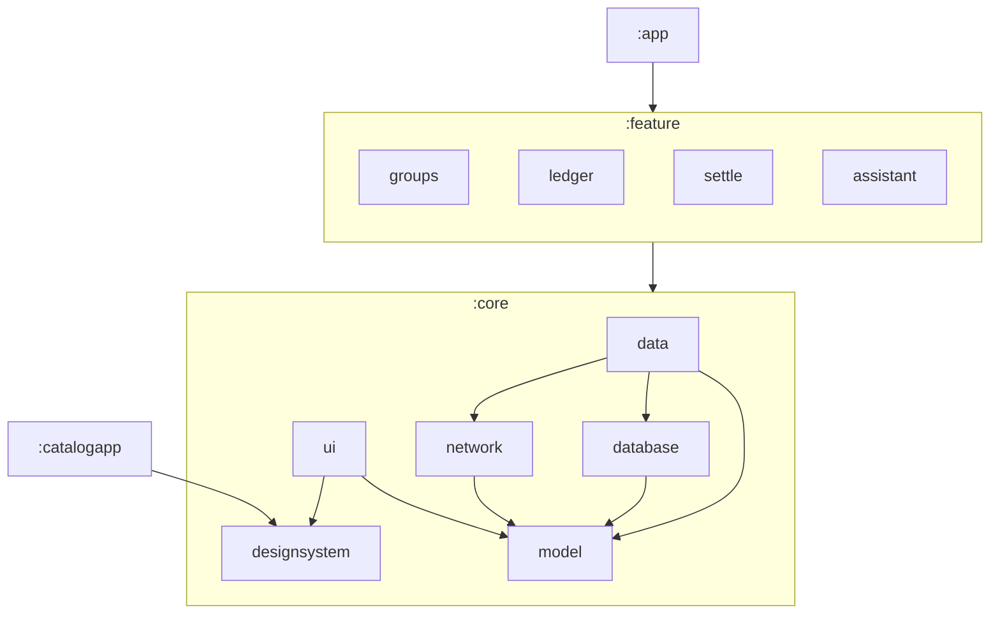
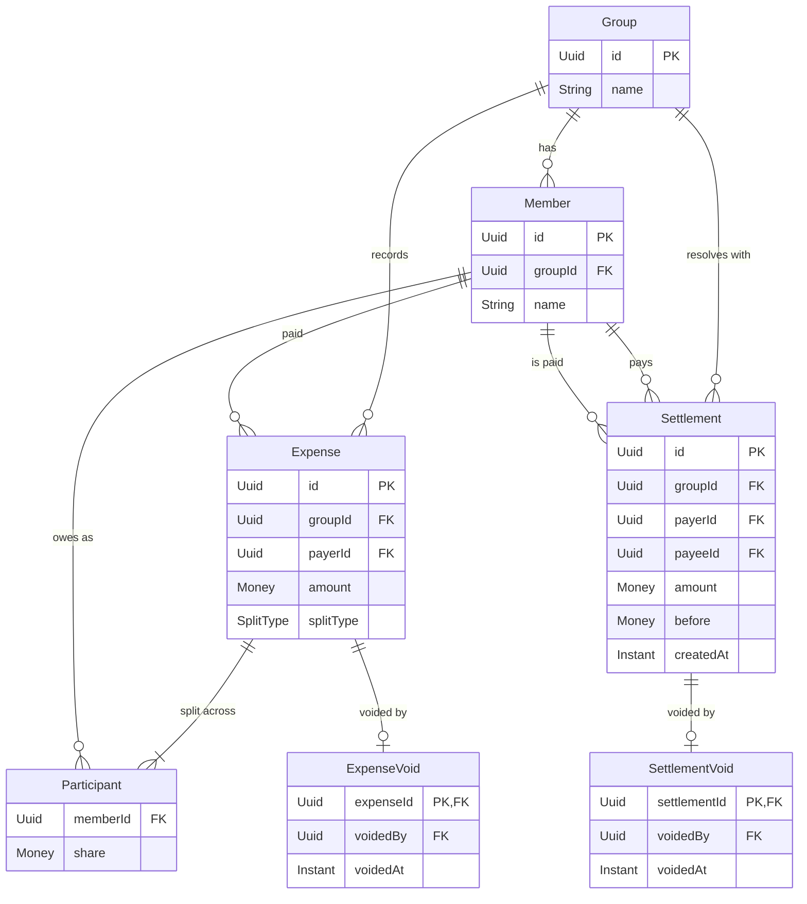

# Ante - Design Document

**Author:** Logan Romantic\
**Status:** Draft\
**Created:** 2026-07-24\
**Repo:** https://github.com/logr/ante\

---

## 1. What this is

Ante is an offline-first shared-expense ledger for groups built with the purpose
of demonstrating Senior/Staff-level Android engineering skills.

## 2. Goals

- Can be evaluated in 15 minutes or less.
- CI gates on every PR, unit and integration tests.
- Modular architecture, dedicated design system
- Settlement and money math work, v1 features delivered

## 3. Non-goals (out of scope for v1)

- Multi-currency conversion - Requires significant time/decisions that do not
  move the project forward to a complete working app. Focus on one currency and
  _then_ look to support more currencies.
- Real auth/accounts (stub identity instead) - Again, not a feature that moves
  us toward our stated v1 goal. With the correct abstractions we can drop in
  real auth later.
- Receipt scanning / OCR
- Push notifications
- Real-time collaboration (eventual sync only)
- Recurring expenses
- KMP / iOS target
- Play Store production release
- Full accessibility audit (basic a11y only)

## 4. Architecture overview

### 4.1 Module graph

Follows closely to Google's
[Guide to Android app modularization](https://developer.android.com/topic/modularization)

### 4.2 Presentation architecture

Follow Google's architecture recommendations: unidirectional data flow (UDF)
with ViewModel and StateFlow, and lifecycle aware - see
[ADR-0001](adr/0001-presentation-architecture.md)

### 4.3 Data & persistence

Room Database as the source of truth with DataStore used for preferences and
config. Database and network are abstracted behind a repository - see ADR
_Persistence & source of truth_ (planned)

## 5. Domain model

This section is _descriptive_: `core:model` is the source of truth for
field-level detail, and this section describes the shape it takes and the rules
it enforces. Where the two disagree, the code is right and this section is
stale.

Three representations are kept deliberately separate, because an offline-first
ledger has different pressures on each:

| Layer       | Lives in        | Specified by                                  |
| ----------- | --------------- | --------------------------------------------- |
| Domain      | `core:model`    | this section                                  |
| Persistence | `core:database` | ADR _Persistence & source of truth_ (planned) |
| Wire        | `core:network`  | ADR _Sync & conflict resolution_ (planned)    |

Everything below is a domain type. Room entities and sync payloads may differ in
shape - normalisation, surrogate keys, and schema versioning belong to those
layers - and `core:data` owns the mapping between them.

### 5.1 Entity relationships

`Participant` is the join that carries the split. A member involved in an
expense, holding that member's share (total obligation).

### 5.2 Invariants

Each entity validates itself independently. A write checks only its own fields
and referenced IDs - no cross-entity locks, no group-wide transactions. Sync
resolves conflicts per-entity.

#### Group

The entry point - that which all other entities reference.

- Members are permanent once added - not deletable.
- Per-group membership (no global identity)

#### Expense

Contains `Participant`. References `Member` by id.

- Expenses cannot be deleted. Reversal is done with an expense void appended to
  the list of facts.
- All fields are immutable after creation.
- The payer is always a participant and receives their share back.
- `sum(Participant.share)` must equal `Expense.amount`. If user-entered exact
  splits do not match, an inline validation error is presented. Absorption is
  only for EQUAL/PERCENTAGE splits.
- Zero-share and negative-share participants are not legal. `share` must be > 0.

#### Settlement

References `Member` by id. Immutable - no edits, only creation. Reversal is done
by creating a settlement void which is an appended fact.

- Idempotency key: `SHA256(groupId + payerId + payeeId + amount + before)`,
  unique among live settlements within a group. Prevents duplicate settlements
  on sync retry.
- `amount` must be > 0

### 5.3 Value objects

- **`Money`** - `Long` minor units in a value class, no division operator;
  splitting goes through total-preserving allocation. See
  [ADR-0002](adr/0002-money-representation.md).
- **`SplitType`** - tag-only enum with three variants: `EQUAL`, `EXACT`,
  `PERCENTAGE`. It tells the domain layer how to compute shares at creation
  time; the resulting amounts are stored directly as `Money` on each
  `Participant`. The type itself carries no data.
  - Percentages use basis points (10,000 = 100%). Each participant's share is
    > 0 and ≤ 10,000. The sum across all participants must equal exactly 10,000.
    > Rounding remainder from the conversion is absorbed by the payer.
- **Identifiers** - a shared `Uuid` type for v1. Each entity has its own type
  alias (`GroupId`, `MemberId`, etc.) but they all resolve to the same
  underlying UUID representation. Client mints IDs at creation time, before any
  sync - this is required for offline-first operation.

### 5.4 Idempotent settlement

Settlements are immutable domain records, but they still flow through a backend
and must reach other clients. The idempotency contract ensures exactly-once
recording even across retries, app kills, and offline queues:

- Idempotency key is `SHA256(groupId + payerId + payeeId + amount + before)`,
  derived from the settlement's own fields - no separate storage needed.
- `before` is signed since overpayment is legal
- Retries use exponential backoff with jitter. See ADR _Sync & conflict
  resolution_ for the full transport protocol.
- Server deduplicates on the idempotency key.
- Accepted edge-case of two devices recording two genuinely different payments
  with an identical amount while offline. This merges into one record which is
  safer than the alternative of double counting.

See [ADR-0005](adr/0005-idempotent-settlement-contract.md) for the full
idempotency contract.

### 5.5 Sync and versioning

`SyncEnvelope` wraps domain changes for transport and carries the versioning
metadata conflict resolution needs. It is a wire-layer type, not a domain
entity, and is specified in ADR _Sync & conflict resolution_ (planned).

Unit of sync is entity-level (Expense, Settlement, and corresponding Voids,
etc.). Entities are immutable facts, append only; no versioning required.
Settlements are deduped via the derived SHA as an idempotency key. Versioning
applies only to Group name and Member name.

## 6. Key flows

Fill out details Week 2. Rough outline provided for now. This is expected to
evolve so take current sections as placeholders that will be finalized later.

### 6.1 Add expense (offline)

### 6.2 Settle up

### 6.3 Rename Conflict: two devices edit offline

### 6.4 AI assistant ("explain my spending")

## 7. Testing strategy

Fill out Week 2.

## 8. CI/CD & quality gates

Fill out Week 3.

## 9. Observability & failure handling

Fill out Week 3.

## 10. AI-assisted workflow

Fill out when AGENTS.md created.

## 11. Roadmap (post-v1)

Fill out no later than Week 5.

## 12. ADR index

ADR numbers are allocated when the record is written, not when the decision is
anticipated - so the sequence reflects the real order decisions were made.
Planned entries below reserve a title, not a number.

| ADR                                                | Title                          | Status   | Decided |
| -------------------------------------------------- | ------------------------------ | -------- | ------- |
| [0001](adr/0001-presentation-architecture.md)      | Presentation architecture      | proposed | Week 1  |
| [0002](adr/0002-money-representation.md)           | Money representation           | proposed | Week 1  |
| [0003](adr/0003-settle-up-algorithm.md)            | Settle-up algorithm            | proposed | Week 1  |
| [0004](adr/0004-modularization-strategy.md)        | Modularization strategy        | proposed | Week 1  |
| [0005](adr/0005-idempotent-settlement-contract.md) | Idempotent settlement contract | proposed | Week 1  |
|                                                    | Persistence & source of truth  | planned  | Week 2  |
|                                                    | Corrections are appends        | planned  | Week 2  |
|                                                    | Sync & conflict resolution     | planned  | Week 3  |

- `planned` - number not yet allocated, ADR not yet written
- `proposed` - written, implementing code not yet on `main`
- `accepted` - implementing code merged to `main`
